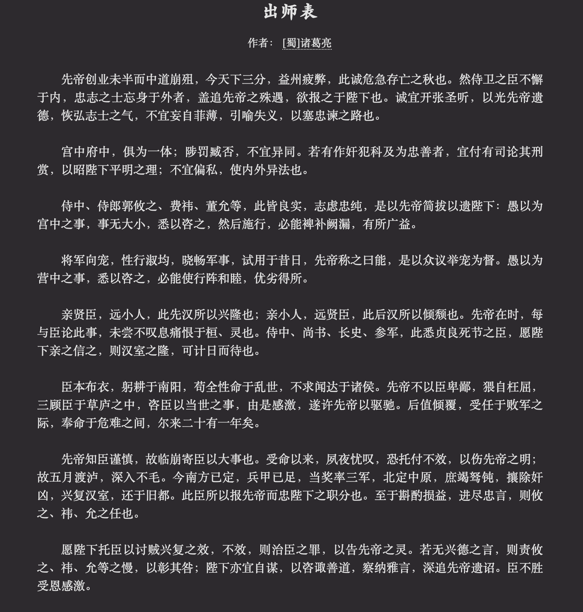

# Hugo Theme Zzo-Heti

该主题在 [Zzo](https://github.com/zzossig/hugo-theme-zzo) 的基础上，融合 [Heti](https://sivan.github.io/heti/) 项目，以优化中文的排版。

## Shortcodes

### 

用于显示诗词。

#### 参数列表

| 名称 | 类型 | 说明 |
| ---- | ---- | ---- |
| title | String | 诗词标题 |
| author | String | 作者 |
| abbr | String | 关于作者的说明，例如字、号 |
| annotation | Boolean | 开启注解模式 |

* Boolean 类型的值请用 "on", "off" 表示

#### 示例

代码：

``` html

独坐幽篁里，
弹琴复长啸。
深林人不知，
明月来相照。

```

效果如下：


### 

用于显示古文。

#### 参数列表

| 名称 | 类型 | 说明 |
| ---- | ---- | ---- |
| title | String | 古文标题 |
| author | String | 作者 |
| abbr | String | 关于作者的说明，例如字、号 |
| annotation | Boolean | 文章开启注解模式 |

#### 示例

代码：

``` html


```

效果如下：



### 

用于显示内联文本，可以使用参数设置成不同的注解样式。

#### 参数列表

| 名称 | 类型 | 说明 |
| ---- | ---- | ---- |
| deco | Enum | 注解类型。详情见下表 |
| content | String | 注解内容的值 |

**注解类型**

| deco | 类型 | content |
| ---- | ---- | ------- |
| abbr | 缩写 | 扩展显示内容 |
| mark | 标记 | N/A |
| u    | 专名号 | 任务、地点等信息 |
| em   | 着重号 | N/A |
| del  | 删除线 | N/A |
| ins  | 插入线 | N/A |
| q  | 引号 | N/A |
| dfn  | 术语 | N/A |
| ruby  | 注音、解释 | 注音等内容 |
| sup  | 上标 | N/A |
| sub  | 下标 | N/A |
