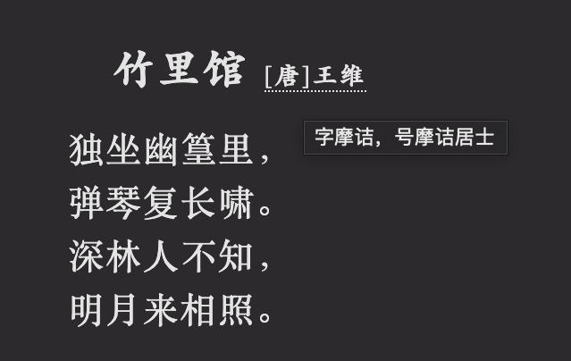

# Hugo Theme Zzo-Heti

该主题在 [Zzo](https://github.com/zzossig/hugo-theme-zzo)的基础上，融合[Heti](https://sivan.github.io/heti/)项目，以优化中文的排版。

## Shortcodes

### 

用于显示诗词。

#### 参数列表

| 名称 | 类型 | 说明 |
| ---- | ---- | ---- |
| title | String | 诗词标题 |
| author | String | 作者 |
| abbr | String | 关于作者的说明，例如字、号 |

#### 示例

代码：

``` html

独坐幽篁里，
弹琴复长啸。
深林人不知，
明月来相照。

```

效果如下：


